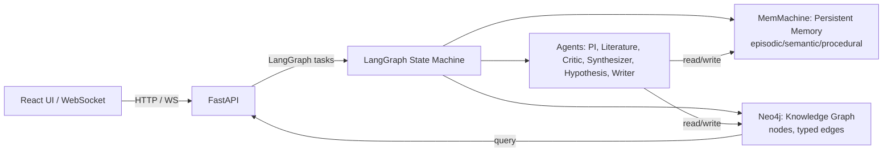

# Memoria Scholae 🧠🌐

**Research That Remembers — Memories That Last**

[](https://devpost.com)
[](https://memmachine.ai)
[](https://neo4j.com)
[](https://github.com/langgraph)

Memoria Scholae is a research assistant platform that combines a persistent memory layer (MemMachine) with graph-native multi-hop reasoning (Neo4j) and a multi-agent orchestration layer (LangGraph). The system is optimized for low-latency recall, auditable provenance, and production-safe agent workflows.

---

# Overview

Short technical summary of what the system provides and why it matters.

* Persistent memory and session recall that capture episodic, semantic, and procedural artifacts.
* Graph-native knowledge representation enabling 1–7° multi-hop reasoning and novelty scoring.
* LangGraph-driven agent orchestration: routing, ingestion, critique, synthesis, hypothesis generation, and automated writing.
* Observability and production guardrails: latency metrics, HITL gating, SHA256 auditable logs, and RBAC.

A canonical user flow:

* Query arrives → LangGraph routes to PI agent → MemMachine recall enriches context → Literature agent indexes into Neo4j → Synthesizer runs multi-hop Cypher → Hypothesis is generated and scored → Output delivered or HITL mandated.

---

# Architecture (visual)

Use this mermaid diagram in docs or renderers that support it. It compresses the architecture into a single technical view.



Design emphasis:

* MemMachine is the contextual store (fast vector and metadata store).
* Neo4j holds structured, typed knowledge enabling path search and scoring.
* LangGraph persists intermediate task state and controls agent handoffs.

---

# Technical components

Short descriptions of the major components and key technical details to know when developing or deploying.

## Frontend

* React (v19) with TypeScript, TailwindCSS, Framer Motion.
* D3.js force simulation for Neo4j graph visualization.
* WebSocket channel for live agent status and progress updates.

## API / Backend

* FastAPI exposing:

  * MemMachine wrappers
  * Neo4j bridge endpoints
  * Orchestration entrypoints for LangGraph workflows
  * Health and metrics endpoints
* End-to-end targets: P95 ≈ 2.8s; MemMachine recall ≈ 47ms; Neo4j Cypher ≈ 2.1ms.

## LangGraph (Orchestrator)

* Orchestrates the multi-agent pipeline: routing, retries, state persistence.
* Tasks are small, deterministic functions that store inputs/outputs to MemMachine with trace metadata.
* HITL gating when `confidence < 0.85`.

## MemMachine (Persistent Memory)

* Stores messages with metadata: `episodic`, `semantic`, `procedural`.
* Exposes store and search HTTP endpoints (used as fast contextual retrieval).
* Recommended record shape:

  ```json
  {
    "type":"episodic",
    "producer":"lucylow",
    "content":"AlphaFold 3: geometric priors ...",
    "timestamp":"2025-03-10T14:22:00Z",
    "metadata":{"session":"alpha-2025-03-10","tags":["alphafold","attention"],"confidence":0.82}
  }
  ```

## Neo4j (Graph Reasoning)

* Canonical nodes: `Concept`, `Paper`, `Experiment`, `Researcher`.
* Relationship types: `DISCUSSES, APPLIES_TO, EXTENDS, CONTRADICTS, CITES, BRIDGES, IMPLEMENTS, EVALUATES, IMPROVES, VALIDATES, CHALLENGES, SYNTHESIZES`.
* Example Cypher multi-hop query:

  ```cypher
  MATCH path = shortestPath((:Concept {name:$c1})-[*1..5]-(:Concept {name:$c2}))
  RETURN path, length(path) AS hops
  ORDER BY hops ASC
  LIMIT 5;
  ```

---

# Project layout

```
memoria-scholae/
├─ backend/                # FastAPI + LangGraph wiring
│  ├─ api/
│  ├─ agents/
│  ├─ memmachine/
│  ├─ neo4j/
│  └─ seeder/
├─ frontend/               # React + D3 + Framer Motion
├─ infra/
│  ├─ docker-compose.yml
│  └─ k8s/
├─ scripts/
├─ seeder/
├─ .env.example
├─ README.md
└─ LICENSE
```

---

# Quickstart — local development

Prerequisites

* Docker & Docker Compose
* Python 3.11 for backend local dev
* Node 18+ for frontend

Set environment

```bash
git clone https://github.com/yourusername/memoria-scholae.git
cd memoria-scholae
cp .env.example .env
# edit .env to set NEO4J_PASSWORD and optional OPENAI_API_KEY
```

Bring up services

```bash
docker-compose up -d
# monitor
docker-compose logs -f memmachine neo4j backend
```

Seed demo data

* Run the provided seeder to push example memories and paper nodes:

```bash
docker build -t memoria-seeder ./seeder
docker run --rm --env-file .env memoria-seeder
```

* Or run locally:

```bash
python seeder/seeder.py
```

Run services in dev mode

```bash
# backend
cd backend/api
pip install -r requirements.txt
uvicorn main:app --reload --port 8000

# frontend
cd frontend
npm install
npm run dev
```

Open

* Frontend UI: `http://localhost:3000`
* Backend docs: `http://localhost:8000/docs`
* Neo4j browser: `http://localhost:7474` (neo4j / password)

---

# Configuration

`.env.example` (copy to `.env` and edit)

```ini
MEMMACHINE_BASE=http://memmachine:8080
MEMMACHINE_ORG=memoria-org
MEMMACHINE_PROJECT=memoria-project

NEO4J_URI=bolt://neo4j:7687
NEO4J_USER=neo4j
NEO4J_PASSWORD=ChangeMeLocally!

OPENAI_API_KEY=
PORT=8000
```

Docker Compose excerpt

```yaml
services:
  memmachine:
    image: memmachine/memmachine:latest
    ports: ["8080:8080"]
  neo4j:
    image: neo4j:5.12-enterprise
    environment: ["NEO4J_AUTH=neo4j/${NEO4J_PASSWORD}"]
    ports: ["7474:7474","7687:7687"]
  backend:
    build: ./backend/api
    env_file: .env
    depends_on: [memmachine, neo4j]
    ports: ["8000:8000"]
```

Neo4j constraints to apply once

```cypher
CREATE CONSTRAINT IF NOT EXISTS FOR (c:Concept) REQUIRE c.name IS UNIQUE;
CREATE CONSTRAINT IF NOT EXISTS FOR (p:Paper) REQUIRE p.doi IS UNIQUE;
```

---

# Example snippets

MemMachine store example (Python)

```python
await memmachine.store(
  episodic={"read_date":"2025-03-10", "confidence":0.82},
  semantic={"concepts":["GeometricReasoning","ProteinContacts"]},
  ttl=None
)
```

Cypher multi-hop novelty query

```cypher
MATCH path=(a:Concept {name:$c1})-[rels*1..5]-(b:Concept {name:$c2})
WITH path, length(path) AS hops, [n IN nodes(path) | size((n)--())] AS degrees
WITH path, hops, apoc.coll.sum([d IN degrees | 1.0/(d+1)]) AS rarity_score
RETURN path, hops, rarity_score, (1.0/(hops+0.1) + rarity_score) AS novelty_score
ORDER BY novelty_score DESC
LIMIT 10;
```

LangGraph workflow pseudocode

```python
# recall -> ingest -> critic -> synthesize -> hypothesize -> write
graph.add_node("pi", pi_agent)
graph.add_node("literature", literature_agent)
graph.add_edge("pi","literature")
graph.add_edge("literature","critic")
graph.add_edge("critic","synthesizer")
graph.add_edge("synthesizer","hypothesis")
graph.set_entry_point("pi")
```

---

# Testing & CI

Local unit tests with pytest

```bash
cd backend/api
pytest -q
```

Recommended CI actions

* Run unit tests for backend and frontend
* Run seeder against a disposable MemMachine instance in integration tests
* Optional: provision temporary Neo4j Aura in CI for end-to-end validation (costs apply)

Example GitHub Actions (CI)

* Checkout
* Install backend deps, run `pytest`
* Optionally seed MemMachine using secrets

---

# Observability and safety

Observability

* JSON structured logs from agents with `{task_id, agent_id, duration_ms, inputs_sha256, outputs_sha256}`
* Prometheus metrics:

  * `memmachine_query_latency_seconds`
  * `neo4j_query_latency_seconds`
  * `agent_task_duration_seconds`
  * `hypothesis_confidence`

Safety & guardrails

* Input validation & prompt-injection protection
* PII auto-redaction before persistent storage
* HITL gating for outputs under confidence threshold
* Immutable audit logs with SHA256 hashes for traceability
* RBAC for researcher/admin/viewer roles

---

# Troubleshooting

MemMachine returns no semantic results

* Ensure an embedding provider is configured (OPENAI_API_KEY or equivalent)
* Check MemMachine logs for embedder errors

Neo4j connection issues

* Confirm `NEO4J_URI` and credentials, use `neo4j+s://` for Aura with TLS
* Validate network egress and DNS for Aura endpoints

Slow multi-hop queries or OOM

* Add constraints and indexes
* Use `shortestPath()` and limit `max_hops`
* Increase instance size or use Aura scaling

LangGraph task failures

* Check agent output format (must be JSON-serializable)
* Enable retries and inspect per-task logs for inputs/outputs

---

# Next steps & roadmap (developer-oriented)

* Improve embedding quality by integrating multiple embedder backends
* Add multi-researcher collaborative memory with conflict resolution
* Turn memmachine/neo4j fallback adapters into pluggable providers for local dev
* Add a web-based HITL review UX with annotations and diff view
* Harden production observability: distributed tracing + alert runbooks

---

# Credits, license, and acknowledgments

Sponsor integrations and ideas:

* MemMachine — persistent memory
* Neo4j — graph reasoning and Aura for managed hosting
* LangGraph — stateful orchestration engine

License: MIT — see `LICENSE`.

